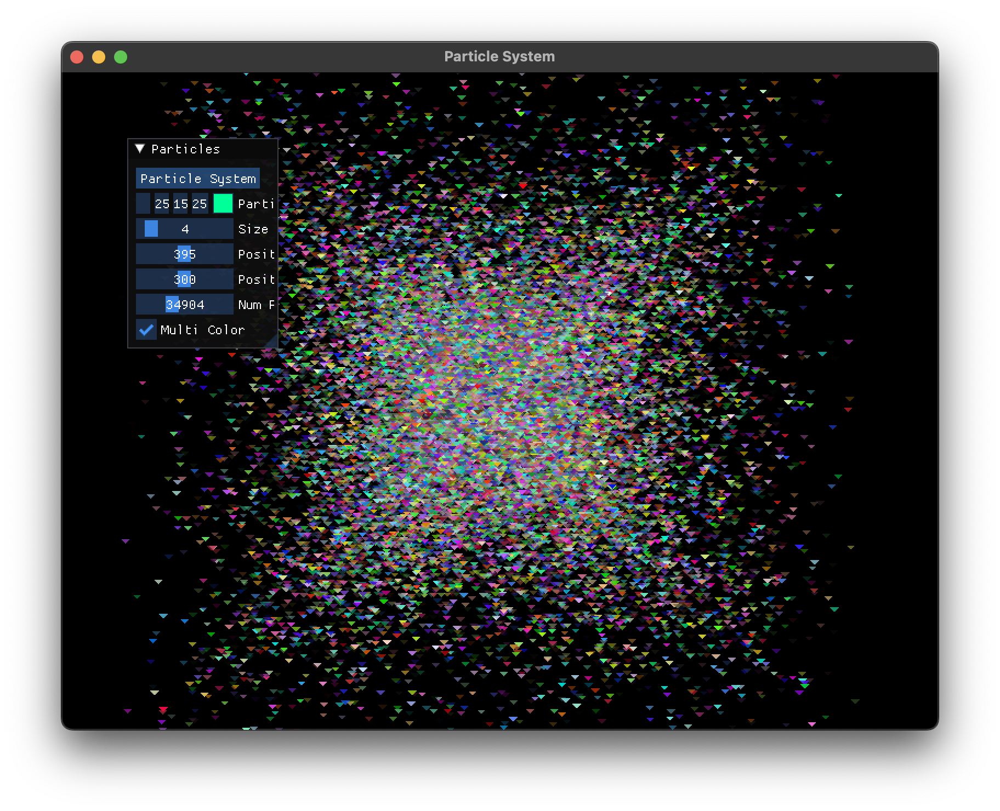

# Particle System

A GUI application made using SFML and IMGUI to simulate particles popping out

## Build Instructions

#### Requirements
- A C++ compiler that supports c++17


```bash
cmake . -B build
cmake --build build -j <number of parallel jobs>
```

## Executing
Execute the proj binary in the build folder to run the program
```bash
./build/proj
```
This application uses SFML that uses opengl behind the scenes and requires appropriate drivers to be installed

## Screenshot

